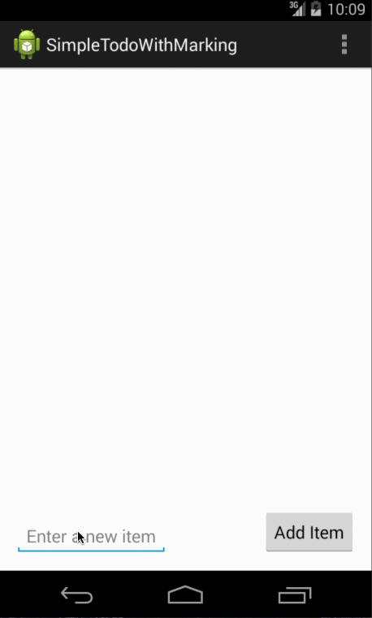

# androidTodoApp
TODO app as codepath assignment.
This includes check box support with persistent storage.

Demo:
1. Add list of items
2. Show that the list is persistent by re-opening the app
3. Using check box to note 'DONE' items.
4. Show that the 'DONE status' is persistent by re-opening the app

